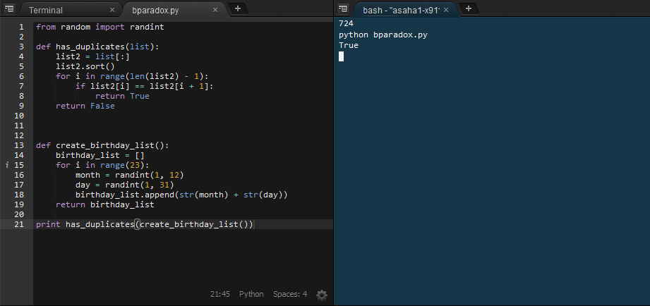
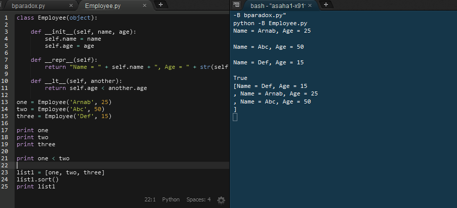
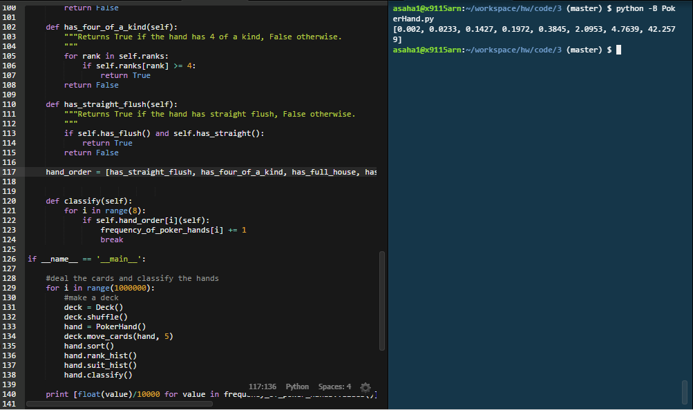

<h2>10.15 Exercise 8 (the Birthday Paradox):</h2>

<h2>Employeee class:</h2>

<h2>Poker</h2>

<table style="width:100%">
  <tr>
    <th>Hand</th>
    <th>Probability from code (in %)</th>		
    <th>Probability from wiki (in %)</th>
  </tr>
  <tr>
    <td>Straight Flush</td>
    <td>0.002</td>		
    <td>0.00139</td>
  </tr>
  <tr>
    <td>Four of a kind</td>
    <td>0.0233</td>		
    <td>0.0240</td>
  </tr>
  <tr>
    <td>Full House</td>
    <td>0.1427</td>		
    <td>0.1441</td>
  </tr>
  <tr>
    <td>Flush</td>
    <td>0.1972</td>		
    <td>0.1965</td>
  </tr>
  <tr>
    <td>Three of a kind</td>
    <td>0.3845</td>		
    <td>0.3925</td>
  </tr>
  <tr>
    <td>Two Pair</td>
    <td>2.0953</td>		
    <td>2.1128</td>
  </tr>
  <tr>
    <td>One pair</td>
    <td>4.7639</td>		
    <td>4.7539</td>
  </tr>
  <tr>
    <td>One pair</td>
    <td>42.2579</td>		
    <td>42.2569</td>
  </tr>
</table>